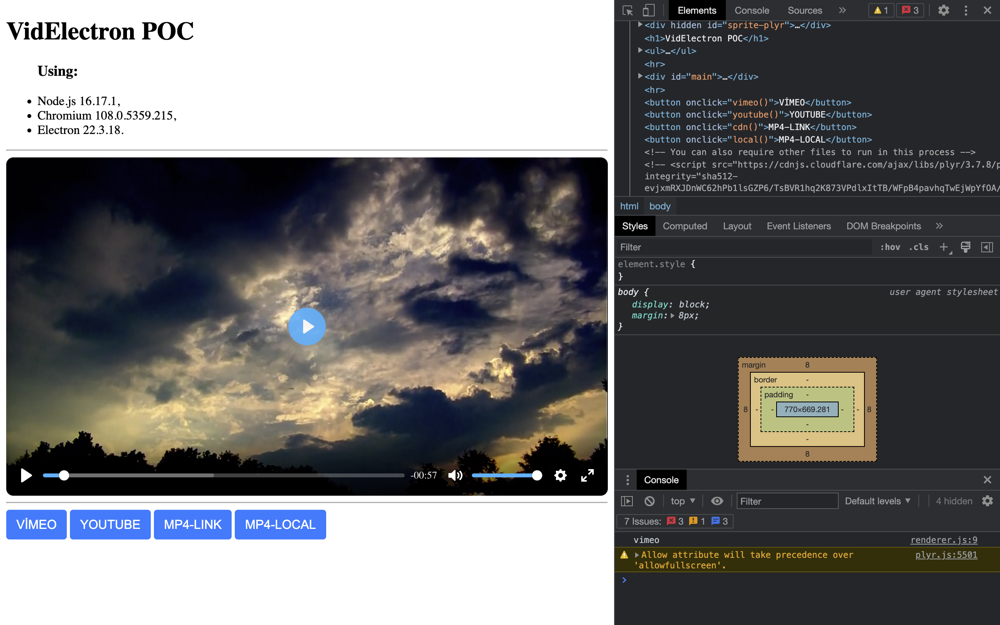

# Videlectron
Proof of Concept: video uses in electron with plyr.io




**Bu uygulamayı kullanmak için bash, node server ve ~~npm~~ yarn gereklidir.**

Yarn kurmak için: 
```bash
npm install --global yarn
```

Aşağıdaki dosyaları revize ederek gerekli aşamalar sağlanabilir:

- `package.json` - Projenin gereklilikleri bulunur ve npm komutlarını içerir. Oluşturacağınız kitap için **name** kısmını güncellemelisiniz.
- `main.js` - Electron projesinin backendi bu dosyadır. Güncelleme kontrolü, browser penceresinin açılmasını bu dosya organize eder. Uygulamanın omurgası burasıdır.
- `index.html` - Bu web sayfası render edilir, Tarayıcı aracılığıyla açılır. dbook3-webpack üzerinden gelmiştir. 
- `electron-builder.env` - Bu dosya electron-builder paketinin okuduğu ve nereye yayınlayacağını söyleyen bilgileri içerir.
- `electron-builder.json` - Bu dosya electron-builder paketi tarafından okunur. İçerisinde kurulum ve paketleme işlemlerini nasıl yapacağını içerir.